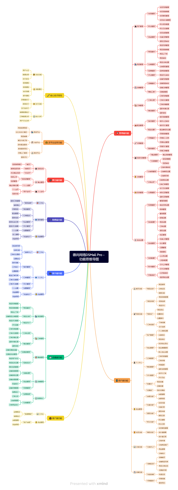

## DSplatform多店铺商城+外卖+上门服务系统
DSPlatform系统是一个集成的解决方案，基于Thinkphp8 + Vue3 + Element Plus + Uniapp 开发，系统支持多种商业模式，包括传统商城购物、外卖配送、上门服务、上门家政、短视频带货等，满足不同行业的业务需求。无论是电商平台、本地生活服务、家政服务还是内容电商，都能快速构建完整的业务体系。


## DSPlatform导航栏目
- <a href="http://help.dsplatform.csdeshang.com/" target="_blank">DSPlatform帮助手册  http://help.dsplatform.csdeshang.com/</a>
- <a href="http://www.csdeshang.com) http://www.csdeshang.com" target="_blank">官网地址 http://www.csdeshang.com) http://www.csdeshang.com</a>


## DSPlatform演示Demo
| 演示角色  | 演示地址                                | 账号 | 账号 |
|-------|-------------------------------------|----|----|
| 后台PC端 | https://dsplatform.admin.csdeshang.com |  test  |  123456  |
| 用户PC端 | https://dsplatform.store.csdeshang.com |  seller  |  123456  |
| 商家PC端 | https://dsplatform.merchant.csdeshang.com |  seller  |  123456  |
| 用户手机端 | https://dsplatform.uniapp.csdeshang.com  |  buyer  |  123456  |
| 骑手手机端 | https://dsplatform.uniapp.csdeshang.com/rider/pages/index/index |  test  | 123456 |
| 师傅手机端 | https://dsplatform.uniapp.csdeshang.com/technician/pages/index/index |  test  | 123456 |


## 📖 项目介绍

DSPlatform是一个基于现代化技术栈构建的多端电商管理系统，支持PC管理后台、H5、小程序、APP等多个平台。系统采用前后端分离架构，提供完整的电商业务解决方案。

### 🎯 核心特性

- **🚀 现代化技术栈** - PHP 8.0+ + ThinkPHP 8.0 + Vue 3 + TypeScript
- **📱 多端支持** - 支持PC管理后台、H5、微信小程序、APP等多个平台
- **🏪 多商户架构** - 支持平台自营、商户入驻、门店管理等多种经营模式
- **💰 完整支付体系** - 集成微信支付、支付宝等主流支付方式
- **🎨 精美UI设计** - 基于Element Plus和UniApp的现代化界面设计
- **🔐 安全可靠** - JWT认证、权限控制、数据加密等安全机制
- **🔧 高度可扩展** - 模块化设计，支持插件化扩展

### 🏢 适用场景

- 🛒 **电商平台** - B2B2C多商户平台
- 🏪 **O2O平台** - 同城配送、外卖平台、家政服务
- 🛍️ **新零售** - 线上线下一体化零售解决方案
- 📦 **供应链管理** - 分销系统、供应商管理
- 🎯 **垂直电商** - 特定行业的电商解决方案

## 📊 思维导图

系统提供完整的多端业务功能，包含管理端、用户端、商户端、骑手端、师傅端、博主端等多个角色的功能模块：




## 🏗️ 系统架构

### 技术栈

#### 后端技术
- **框架**: ThinkPHP 8.0
- **语言**: PHP 8.0+
- **数据库**: MySQL 8.0+
- **文件存储**: 本地存储 / 阿里云OSS / 腾讯云COS

#### 前端技术
- **管理后台**: Vue 3 + Element Plus + Vite
- **移动端**: UniApp + Vue 3
- **构建工具**: Vite 5.2+
- **状态管理**: Pinia
- **HTTP客户端**: Axios
- **样式**: SCSS + Tailwind CSS

#### 第三方集成
- **支付**: 微信支付、支付宝
- **短信**: 阿里云短信、腾讯云短信
- **地图**: 腾讯地图、高德地图、百度地图

### 系统架构图

```
┌─────────────────────────────────────────────────────────────┐
│                        用户层                                │
├─────────────┬─────────────┬─────────────┬─────────────────────┤
│  PC管理后台  │   H5商城    │  微信小程序  │      APP应用        │
│ Vue3+Element│ UniApp+Vue3 │ UniApp+Vue3 │    UniApp+Vue3     │
└─────────────┴─────────────┴─────────────┴─────────────────────┘
                                │
┌─────────────────────────────────────────────────────────────┐
│                      API网关层                               │
├─────────────┬─────────────┬─────────────┬─────────────────────┤
│   管理端API  │   用户端API  │  商户端API   │     其他端API       │
│  AdminAPI   │  UserAPI    │ MerchantAPI │ RiderAPI/TechAPI   │
└─────────────┴─────────────┴─────────────┴─────────────────────┘
                                │
┌─────────────────────────────────────────────────────────────┐
│                    业务服务层                                │
├─────────────┬─────────────┬─────────────┬─────────────────────┤
│   用户服务   │   商品服务   │   订单服务   │     支付服务        │
│   权限服务   │   营销服务   │   物流服务   │     消息服务        │
└─────────────┴─────────────┴─────────────┴─────────────────────┘
                                │
┌─────────────────────────────────────────────────────────────┐
│                    数据存储层                                │
├─────────────┬─────────────┬─────────────┬─────────────────────┤
│    MySQL    │    Redis    │   文件存储   │     第三方服务      │
│   主从复制   │   缓存队列   │  OSS/本地   │   微信/支付宝/物流   │
└─────────────┴─────────────┴─────────────┴─────────────────────┘
```

## 🚀 快速开始

### 环境要求

#### 基础环境
- **PHP**: 8.0+
- **MySQL**: 8.0+
- **Redis**: 6.0+
- **Node.js**: 16.0+
- **Nginx**: 1.20+ (推荐)

#### 推荐配置
- **服务器**: 2核4G内存起步，4核8G内存推荐
- **存储**: SSD硬盘，至少50GB可用空间
- **网络**: 带宽5M以上，推荐10M+

### 安装部署

#### 1. 克隆项目

```bash
git clone https://github.com/your-org/dsplatform.git
cd dsplatform
```

#### 2. 后端部署

```bash
# 进入后端目录
cd php-server

# 安装PHP依赖
composer install

# 访问域名进行安装
访问配置域名进行安装

```

#### 3. 管理后台部署

```bash
# 进入管理后台目录
cd vue-element-admin

# 安装依赖
npm install

# 配置API地址
cp .env.development .env.production

# 开发环境启动
npm run dev

# 生产环境构建
npm run build
```

#### 4. 移动端部署

```bash
# 进入移动端目录
cd uniapp

# 安装依赖
npm install

# 配置API地址
cp .env.development .env.production

# 开发环境启动（H5）
npm run dev:h5

# 构建小程序
npm run build:mp-weixin

# 构建APP
npm run build:app
```


## 🙏 致谢

感谢以下开源项目的支持：

- [ThinkPHP](https://www.thinkphp.cn/) - 高性能PHP框架
- [Vue.js](https://vuejs.org/) - 渐进式JavaScript框架
- [Element Plus](https://element-plus.org/) - Vue 3组件库
- [UniApp](https://uniapp.dcloud.io/) - 跨平台应用开发框架
- [EasyWeChat](https://www.easywechat.com/) - 微信SDK
